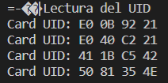

# Practica 6B: Busos de comunicació II (SPI, Lector RFId)
L'objectiu d'aquest apartat es continuar treballant amb el bus SPI que implementa la ESP32. Aquesta vegada implementarem un lector de tags RFId.
___
## CODI DE LA PRÀCTICA
```
#include <Arduino.h>
#include <SPI.h>
#include <MFRC522.h>

#define RST_PIN	17   
#define SS_PIN	5  
MFRC522 mfrc522(SS_PIN, RST_PIN); 

void setup() {
	Serial.begin(9600); 
	SPI.begin();        
	mfrc522.PCD_Init(); 
	Serial.println("Lectura del UID");
}

void loop() {
	if ( mfrc522.PICC_IsNewCardPresent()) 
        {
            if ( mfrc522.PICC_ReadCardSerial()) 
            {
                  Serial.print("Card UID:");
                  for (byte i = 0; i < mfrc522.uid.size; i++) {
                          Serial.print(mfrc522.uid.uidByte[i] < 0x10 ? " 0" : " ");
                          Serial.print(mfrc522.uid.uidByte[i], HEX);   
                  } 
                  Serial.println();
                  mfrc522.PICC_HaltA();         
            }      
	}	
}
```
___
## FUNCIONAMENT 
En aquest apartat de la pràctica s'utilitzen les següents llibreries:
* "SPI.h": per la gestió del bus SPI.
* "MFRC522.h": pel lector de tags RFId.
___
### Creació de l'objecte MFRC522
```
#define RST_PIN	17   
#define SS_PIN	5  
MFRC522 mfrc522(SS_PIN, RST_PIN); 
```
Primer es defineixen els pins de la ESP32 que actuaràn com a "reset" (RST) i "slave select" (SS) del lector de tags RFId.

Seguidament es crea l'objecte MFRC522 amb els pins que hem definit
___
### Setup
```
void setup() {
	Serial.begin(9600); 
	SPI.begin();        
	mfrc522.PCD_Init(); 
	Serial.println("Lectura del UID");
}
```
Al setup s'inicialitzen tant el bus SPI com el lector de tags.

Es mostra pel terminal un primer missatge: "Lectura del UID", que dona peu a la resta de sortides per terminal que executarà el loop.
___
### Loop
El loop del programa estarà constantment revisant si s'ha apropat algun tag al lector RFId, i en el cas de poder llegir el seu codi UID, el mostrarà pel terminal:
```
void loop() {
	if ( mfrc522.PICC_IsNewCardPresent()) 
        {
            if ( mfrc522.PICC_ReadCardSerial()) 
            {
                  Serial.print("Card UID:");
                  for (byte i = 0; i < mfrc522.uid.size; i++) {
                          Serial.print(mfrc522.uid.uidByte[i] < 0x10 ? " 0" : " ");
                          Serial.print(mfrc522.uid.uidByte[i], HEX);   
                  } 
                  Serial.println();
                  mfrc522.PICC_HaltA();         
            }      
	}	
}
```
El loop presenta dos condicionals abans d'iniciar la lectura del codi UID de la possible targeta que s'hagi apropat:

* El primer revisa si el lector detecta que s'ha apropat un nou tag RFId:
```
if ( mfrc522.PICC_IsNewCardPresent()) 
    {
     ---     
	}
```
* El segon revisa si el codi UID del tag es pot llegir:
```
 if ( mfrc522.PICC_ReadCardSerial()) 
     {
                ---
     }
```
Finalment, si es compleixen les condicions anteriors, s'efectuarà la lectura del codi i es mostrarà pel terminal en format hexadecimal:
```
  Serial.print("Card UID:");
  for (byte i = 0; i < mfrc522.uid.size; i++) {
    Serial.print(mfrc522.uid.uidByte[i] < 0x10 ? " 0" : " ");
    Serial.print(mfrc522.uid.uidByte[i], HEX);   
    } 
   Serial.println();
   mfrc522.PICC_HaltA(); 
```
___
## Sortida pel terminal
Pel terminal se'ns va mostrant el codi UID de les diferents targetes que s'apropen al lector:


